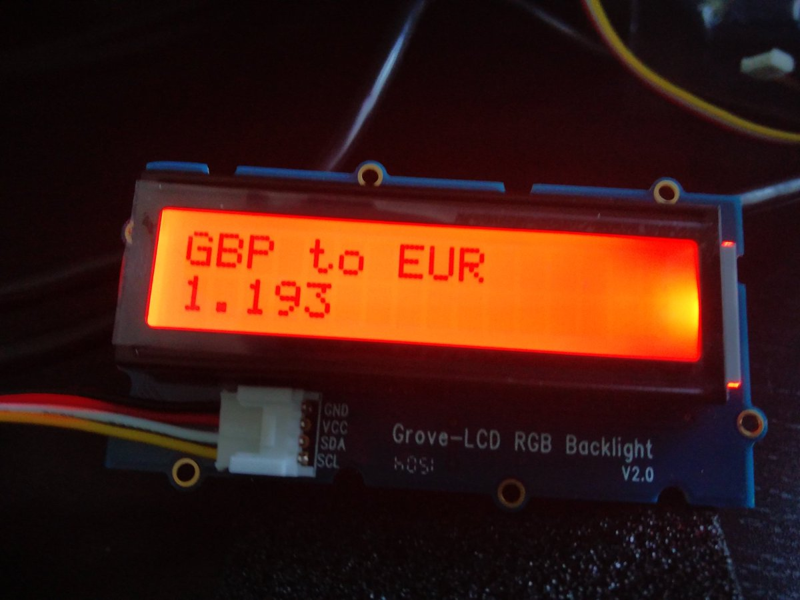

edison_gbp_to_eur
=================

This is a simple project to show in a Grove LCD screen the exchange rate between GBP and EUR using an Intel Edison.

I set up some thresholds for the colors:

- It will be red until 1.20
- Blue between 1.20 and 1.30
- Green otherwise

Dev'ing
-------

I am using [Mastermind glide](https://github.com/Masterminds/glide) for our deps, but feel free to use whatever you want. In case that you want to do it as us:

    glide install
    
Take a look to the `Makefile` to be sure that all the params are correct. Add a password if you need it. And now to cross compile the project, send it to the Edison and run it:

    make
    
If at this step you don't see the exchange rate in your screen something went wrong.

Running it at startup
---------------------

There is a systemd script provided, the steps to use it are:

    scp edison_gbp_to_eur.service root@[edison_ip]:/etc/systemd/system
    ssh root@[edison_ip] systemctl enable edison_gbp_to_eur
    
You could have done this with:

    make install
    
And now if you restart your Edison you should have the project running.
